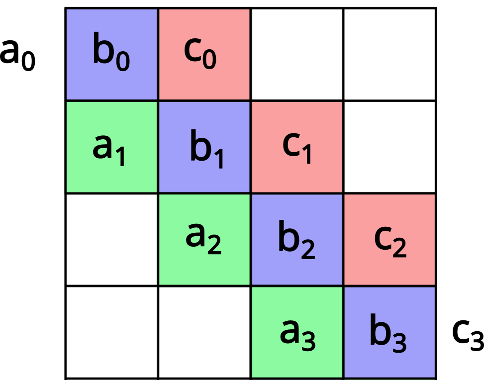
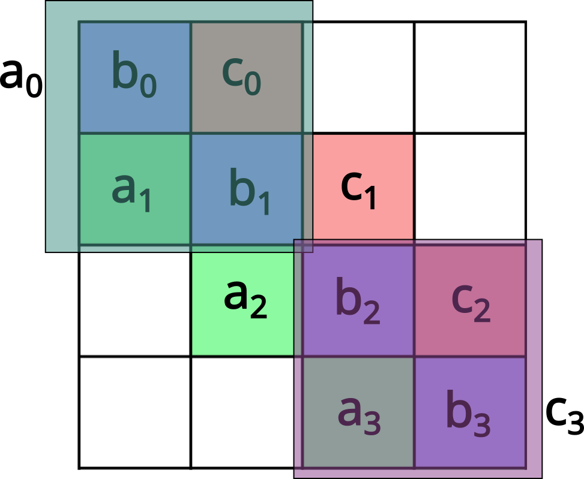
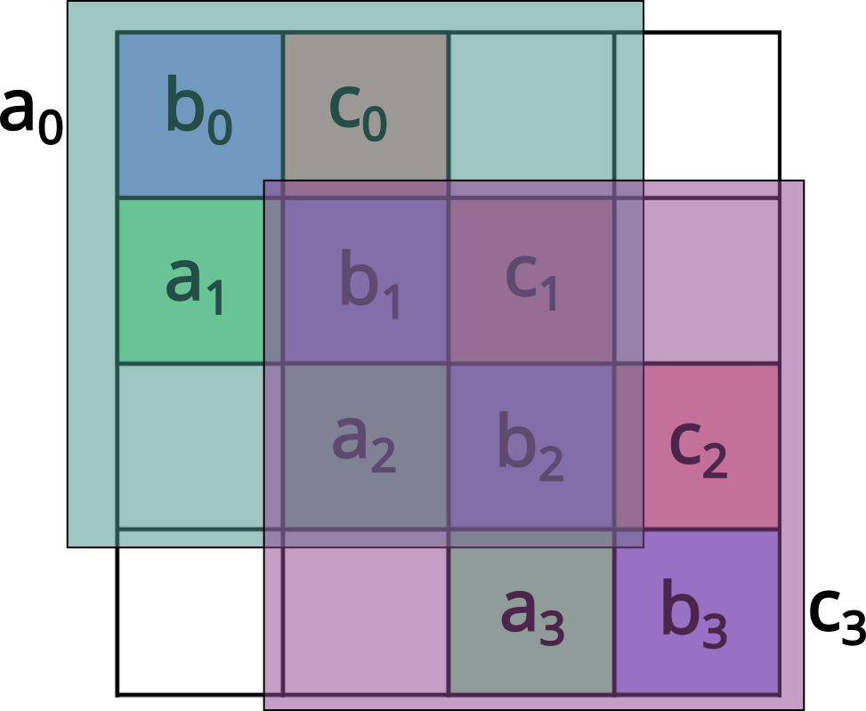

# Задача 02

Параллельный метод прогонки для трёхдиагональной СЛАУ.

---
Решается краевая задача:

$$
-\frac{d^2u}{dx^2}=f(x),\qquad x\in[0,1].
$$

После дискретизации получаем трёхдиагональную систему:

$$
Au=f,
$$

где каждое уравнение имеет вид:

$$
a_i u_{i-1}+b_i u_i+c_i u_{i+1}=f_i.
$$

Для хранения трёхдиагональной матрицы используются три массива:

* `a` — нижняя диагональ;
* `b` — главная диагональ;
* `c` — верхняя диагональ.

## 1. Последовательное решение

Реализовать последовательное решение трёхдиагональной системы методом прогонки (`thomas`).

Полученное решение проверить по невязке:

$$
R=\sum_i (Au-f)_i^2.
$$

В функции `create_tridiag_matrix` задаётся тестовая матрица, для которой известно точное решение:

$$
u_i=\frac{i}{n-1}.
$$

Проверить полученное решение с точным решением.

## 2. Разбиение на поддомены

Реализовать функцию `thomas_range`, выполняющую метод прогонки для заданного диапазона неизвестных.

- Разделить неизвестные между потоками последовательными блоками;
- Каждый поток отвечает только за свой блок неизвестных;
- При решении локальной системы поток должен использовать значение соседних элементов, принадлежащих соседним поддоменам.

## 3. Параллельное решение

Реализовать функцию `thomas_parallel`.

На этом этапе использовать неперекрывающиеся поддомены: каждая неизвестная должна принадлежать только одному потоку.

- Cоздать заданное количество потоков;
- Разделить неизвестные между потоками;
- В каждом потоке выполнять решение своего поддомена с помощью thomas_range;
- Записывать найденные значения в общий вектор нового приближения;
- Повторять вычисления до достижения заданной точности.

Для обмена информацией между соседними поддоменами использовать значения предыдущего приближения решения.

### Синхронизация потоков
После вычисления своего поддомена каждый поток должен вызвать std::barrier, чтобы дождаться остальных потоков и обновить значения соседных элементов.

После того как все потоки завершили текущую итерацию:
- Новое приближение становится предыдущим;
- Вычисляется невязка;
- Принимается решение о завершении вычислений или переходе к следующей итерации.

### Условие остановки

После каждой итерации вычислять невязку решения и завершить вычисления, если $R < 10^{-8}$.

Также установить максимальное количество итераций, чтобы избежать бесконечного выполнения программы.

## 4. Перекрывающиеся поддомены

Усложнить параллельное решение, добавив перекрытие поддоменов.

В предыдущем пункте каждый неизвестный принадлежал только одному потоку. Теперь соседние поддомены должны иметь общие граничные элементы.

В перекрывающейся области значения неизвестных должны быть доступны обоим потокам.

Модифицировать `thomas_parallel` таким образом, чтобы:

* Поддомены имели перекрывающиеся граничные элементы;
* Каждый поток учитывал значения из перекрывающейся области при решении своего поддомена;
* Значения в перекрывающихся областях синхронизировались между потоками;
* Сохранялось условие остановки по невязке.
